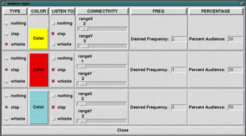

*Nuria Oliver and Stephen Intille — MIT Media Lab*

MIT Media Lab class project, Spring 1996.

## Overview

This project implements a system that models audience behavior using multiple communicating agents. Each agent is a simple model of a person in a grid-like auditorium who listens for stimuli (clapping, whistling) from nearby agents and responds according to assigned rules. The goal is to construct audience simulations that start with chaotic behavior and converge to interesting collaborative patterns — such as synchronized rhythms — in a completely decentralized way. Agents communicate only *through the environment* by observing what neighbors have done in the recent past.

## Agent Types

Each simulation uses up to ten agent types, each defined by four parameters:

- **Action type:** The behavior the agent can perform (clap, whistle, or do nothing).
- **Listen type:** The type(s) of behavior the agent perceives (e.g., clapping only, or both clapping and whistling).
- **Desired frequency:** The agent's target action rate relative to perceived neighbor frequency (e.g., whistle every four claps heard).
- **Connection type:** The size of the neighborhood the agent listens to — a configurable grid centered on the agent's position.

Each agent type is also assigned a **percentage** of the total audience and a display **color** that flashes when the agent is active.

## System

The Tcl/Tk user interface allows interactive configuration of seating grid size, number of agent types, and simulation parameters. Once configured, agents can be created and the simulation run. Active agents flash their assigned color in the seating grid at each time step.

*Agent configuration interface.*

## Temporal Perception

Agents require a memory mechanism to infer the frequency of their neighbors' actions. Each agent stores a history of the last sixteen time steps, which neighboring agents can access. To compute neighbors' frequency, an agent identifies the two time steps with the most observed activity and treats the interval between them as the current frequency — a majority-rule approach that mirrors how humans synchronize in real settings.

## Simulation Results

Key behavioral patterns observed:

- **Independent groups:** Two groups that do not listen to each other each converge rapidly within their own group but not across groups.
- **Inter-related groups, same frequency:** Groups listening to each other with the same target frequency converge so that all agents act simultaneously.
- **Inter-related groups, different frequencies:** Convergence depends on the specific listening relationships — some configurations converge naturally; others cannot, due to cyclic dependencies.

Key factors affecting convergence:

- **Neighborhood size:** Larger neighborhoods produce faster convergence. Real audiences converge quickly because people can attend to a wide area.
- **Agent distribution:** High percentages of converging agent types produce large synchronized clusters, with boundary agents oscillating between two non-converging groups.
- **Isolated agents:** Agents with no neighbors of the listened-for type remain inactive throughout.

## Conclusions and Possible Extensions

The system performs as expected and constitutes an adequate initial model of audience behavior. Possible extensions include:

- More realistic perception models (e.g., distance-weighted listening, loudness effects).
- Real audio output to produce musical behaviors alongside visual ones.
- Alternative temporal frequency detection policies.
- A parallel implementation to support much larger, more realistic simulations.

## Technical Details

Implemented in C++ and Tcl/Tk, compiled on an SGI Indy workstation.
