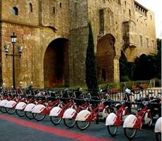
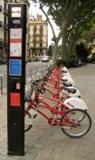
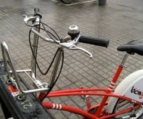
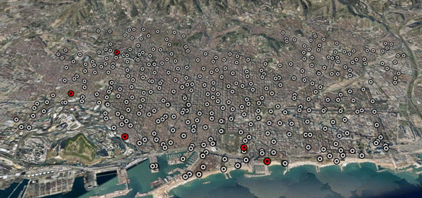
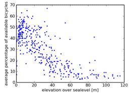
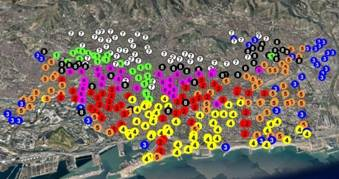

## Abstract

City-wide urban infrastructures are increasingly reliant on networked technology to improve and expand their services. As a side effect of this digitalization, large amounts of data can be sensed and analyzed to uncover patterns of human behavior. These digital footprints have implications for city planners and the citizens that live or visit those cities. To highlight the potential of such datasets, we focus on digital footprints from shared bicycling systems. We provide a spatio-temporal analysis of six weeks of bicycle station usage data from Barcelona's shared bicycling system, Bicing. Using a combination of clustering and Bayesian Networks, we show how these digital traces can be used to uncover and predict behaviors. We apply clustering techniques to identify shared behaviors across stations and explore how those behaviors relate to location, neighborhood, and time of day. We then show how Bayesian Networks can model and predict station usage.

  

*Figure 1. (a) A nearly full Bicing station; (b) A station kiosk; (c) A close-up of a locked bicycle.*

*Figure 1d. A map of Barcelona showing the location of the 373 Bicing stations.*

 

*Figure 2. (a) Clustering results; (b) Scatterplot of station elevation vs. average number of available bicycles.*

## Publications

["Sensing and Predicting the Pulse of the City through Shared Bicycling"](/publications/#froehlich2009bicycling)
Froehlich, J., Neumann, J., and Oliver, N.
*IJCAI 2009*, Pasadena, CA, July 2009. Acceptance rate: 25.7%.

["Measuring the Pulse of the City through Shared Bicycle Programs"](/publications/#froehlich2008bicycle)
Froehlich, J., Neumann, J., and Oliver, N.
*UrbanSense08 Workshop*, Raleigh, NC, November 2008.

## Press

- ["Telefonica develops solutions for Bicing"](elpaisbicingoct08.pdf). *El País*, October 2008.
- ["Telefonica works on 3D video and social shopping"](expansioncatalunyaoct08-1.pdf). *Expansión*, October 2008.
- ["Telefonica predicts that the mobile phone will be used to do social shopping"](expansioncatalunyaoct08.pdf). *Expansión*, October 2008.
