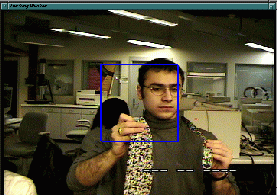
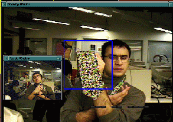
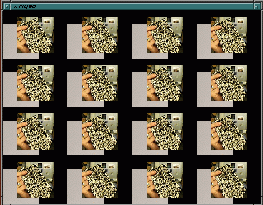
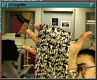
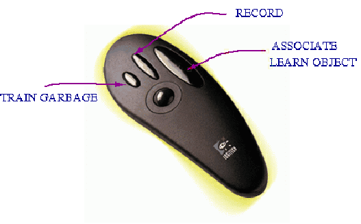
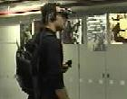

*Nuria Oliver, Tony Jebara, Bernt Schiele and Alex Pentland — MIT Media Lab*

## Abstract

DyPERS (Dynamic Personal Enhanced Reality System) uses augmented reality and computer vision to overlay video and audio clips onto real objects that the user is paying attention to. The system is wearable and adaptively learns an audio-visual memory, associating everyday objects with relevant media to evoke or play back in the future.

## System Architecture

The three main components of DyPERS are:

1. **Audio-visual memory** — accumulates personal memories and associates them with objects.
2. **Generic trainable object recognition** — uses computer vision with invariance to scaling, translation, rotation, small lighting changes, and object deformations.
3. **Wearable interface** — provides audio-visual input/output via a Heads-Up Display, wireless mouse, and wireless microphone.

 

*Real-time audio-visual recording and playback.*

 

*Object recognition and association.*

## Hardware

- ELMO CCD QN401E color camera
- Wireless 3-button mouse
- Wireless microphone
- Glasstron heads-up display and headphones
- SGI O2 workstation
- Wavecom Jr. transmitter/receiver units

## Interface

The interface paradigm is **Record and Associate**: two buttons on a wireless mouse let the user record video and audio in real time. A third button provides negative feedback to delete an incorrect association.

## Applications

Examples of objects and situations DyPERS can recognize and augment:

1. **Clock** — displays the user's daily schedule.
2. **Demo poster** — plays a short video associated with the poster.
3. **Multilingual teacher** — speaks the name of recognized objects in multiple languages.
4. **Stuffed animal** — triggers an associated story when a child looks at the toy.
5. **Augmented storybook** — associates pages of a children's book with narration.
6. **Keypad door lock** — reminds the user of the correct combination.
7. **Business card** — plays a recorded conversation to recall who the card belongs to.
8. **Origami** — plays step-by-step instructions for creating origami objects.
9. **Machinery** — plays maintenance or operating instructions associated with an appliance.
10. **CD / movie poster** — plays a preview clip associated with the media.
11. **Accessibility** — associates objects with audio descriptions for visually impaired users.
12. **Medicine** — plays dosage instructions when the user looks at the medication container.
13. **Store logo** — displays the nearest location, hours, and relevant items.
14. **Art objects** — plays explanations about paintings, sculptures, or other works.

## Videos

## Publications

["DyPERS: Dynamic Personal Enhanced Reality System"](dypers_icvs99.pdf)
Bernt Schiele, Nuria Oliver, Tony Jebara and Alex Pentland.
*ICVS 1999*, Gran Canaria, Spain, January 1999.

["Sensory Augmented Computing: Wearing the Museum's Guide"](micro4.pdf)
Bernt Schiele, Tony Jebara and Nuria Oliver.
*IEEE Micro*, 2001.
