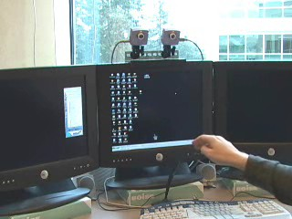

## Abstract

Perceptual user interfaces promise modes of fluid computer-human interaction that complement the mouse and keyboard, and are well motivated in non-desktop scenarios such as media center control. Such interfaces have been slow to gain adoption for a variety of reasons, including computational burden, a lack of robustness outside the laboratory, unreasonable calibration demands, and a shortage of sufficiently compelling applications. We address these difficulties with a fast stereo vision algorithm for interacting with the computer at a distance. The system uses two inexpensive video cameras to extract depth information, which enhances automatic object detection and tracking robustness. We demonstrate the algorithm in combination with speech recognition for window management tasks, present preliminary user study results, and discuss implications for tomorrow's user interfaces.

*GWindows in use: stereo vision interface, multi-monitor setup, moving windows by hand, and ink-drawing.*

## Publications

[GWindows: Towards Robust Perception-Based UI](/papers/wilson2003gwindows.pdf)
Andy Wilson and Nuria Oliver.
*CVPR 2003 Workshop on Computer Vision for HCI*.

## Videos

- [High resolution (1.5 Mbps)](gwindows-video-1500k.mp4)
- [Low resolution (384 Kbps)](gwindows-video-384k.mp4)

## Press

- [CNN Headline News, "Hot Wired"](gwindows-cnn-7-march-2003.mp4), March 7, 2003.
