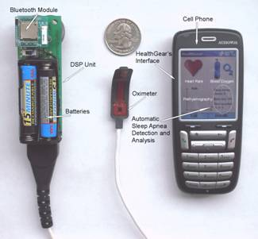

## Abstract

HealthGear is a real-time wearable system for monitoring, visualizing, and analyzing physiological signals. It consists of a set of non-invasive physiological sensors wirelessly connected via Bluetooth to a cell phone, which stores, transmits, and analyzes the physiological data and presents it to the user in an intelligible way. We developed a first prototype using a blood oximeter to monitor the user's blood oxygen level and pulse while sleeping, along with two different algorithms for automatically detecting sleep apnea events. We evaluated the performance of the overall system in a sleep study with 20 volunteers.

*HealthGear hardware.*

## Publications

[[publication:oliver2006healthgear]]

## Videos

- [HealthGear demo](healthgear-iswc05.mp4)
- [Anonymized HealthGear demo](healthgear-pervasive06.mp4)

## Presentations

