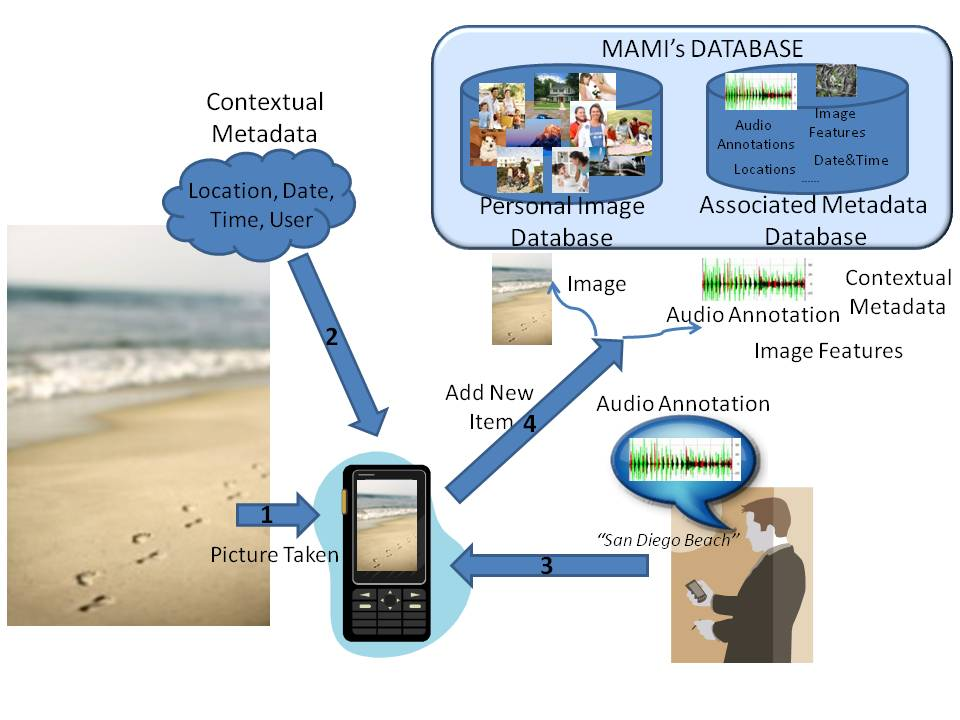
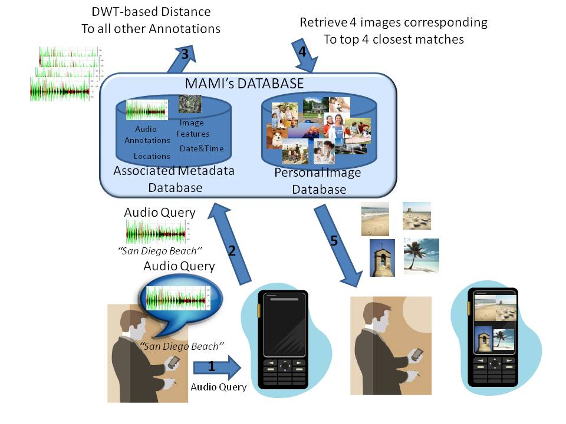

## Abstract

We present MAMI (Multimodal Automatic Mobile Indexing), a mobile-phone prototype that allows users to annotate and search for digital photos via speech input. MAMI runs in real-time on the phone. Users can add speech annotations at the time of capturing photos or at a later time; additional metadata including location, user ID, date, time, and image-based features is stored automatically. Users can search their personal photo repository by speech. MAMI does not require server connectivity — instead of full speech recognition, we use a Dynamic Time Warping-based metric to measure the distance between speech input and existing annotations.

 

*MAMI in capture/annotation mode (left) and search mode (right).*

## Publications

["Multimodal Photo Annotation and Retrieval on a Mobile Phone"](mobileIR_final.pdf)
Xavier Anguera, JieJun Xu and Nuria Oliver.
*Int. Conf. on Multimedia Information Retrieval (MIR'08)*, October 2008.

[MAMI: Multimodal Annotations on a Camera Phone](mhci2008_mami.pdf)
Xavier Anguera and Nuria Oliver.
*Int. Conf. on Mobile HCI*, Amsterdam, September 2008.

[Mobile and Multimodal Personal Image Retrieval: A User Study](mobileIR_final.pdf)
Xavier Anguera, Nuria Oliver and Mauro Cherubini.
*Workshop on Mobile Information Retrieval (MobIR'08), SIGIR 2008*, Singapore, July 2008.
