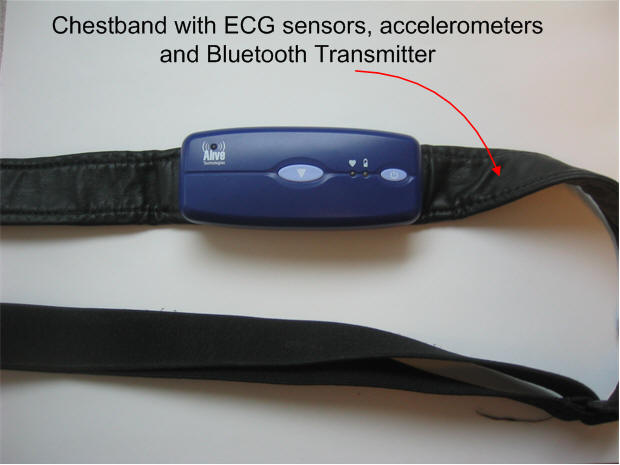
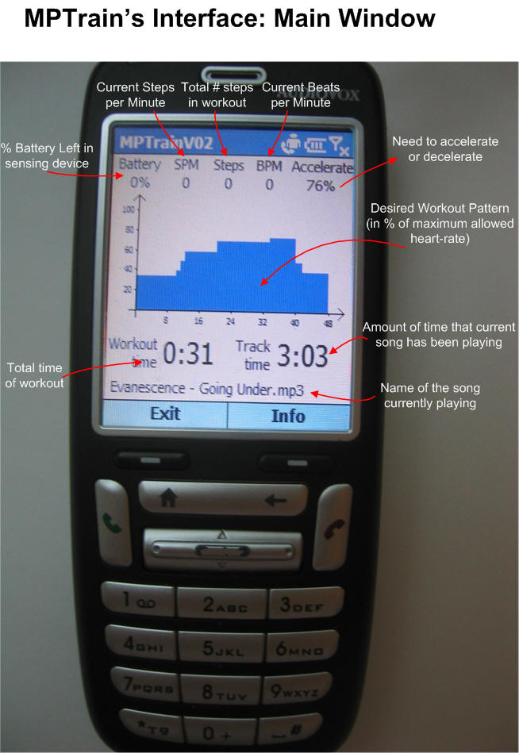
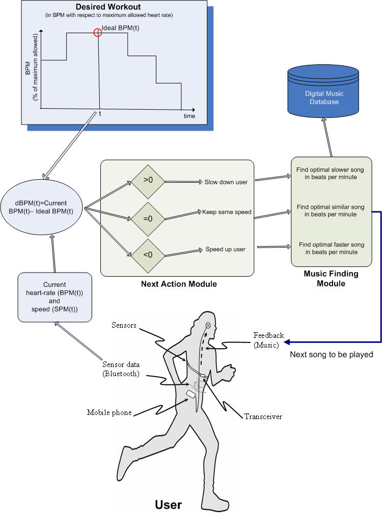

## Abstract

MPTrain is a mobile phone-based system that takes advantage of the influence of music on exercise performance, enabling users to easily achieve their exercise goals. Users enter a desired exercise pattern (target heart rate over time), and MPTrain assists them by: (1) constantly monitoring heart rate and pace; and (2) selecting and playing music with specific features that encourage the user to speed up, slow down, or maintain pace to stay on track.

 

*MPTrain hardware: [AliveTec](http://www.alivetec.com/products.htm) chestband with ECG, accelerometer, and Bluetooth; Audiovox smartphone.*

*MPTrain data flow diagram.*

See also the successor system: [TripleBeat](/projects/triplebeat/).

## Publications

[[publication:oliver2006mptrain]]

[[publication:oliver2006papa]]

[[publication:oliver2006enhancing]]

## Presentation

- [Real-time Physiological and Contextual Monitoring on the Smartphone (PDF, 1.9 MB)](mptrain-presentation.pdf)

## Videos

- [MPTrain demo](mptrain-v1-18.mp4)
