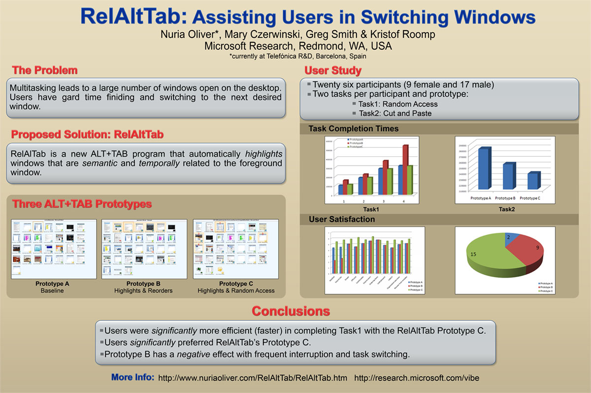

## Abstract

RelAltTab is an enhanced Alt+Tab prototype that assists users in switching windows. It uses semantic and temporal information to create a list of windows related to the one the user is currently engaged in, based on the assumption that users are more likely to switch to a related window than to an arbitrary one. We propose two different user interfaces that present the related window list, and report a user study with 26 participants comparing our approach to standard Windows Alt+Tab.

## Publications

[RelAltTab: Assisting Users in Switching Windows](/papers/iui2008.pdf)
Nuria Oliver, Mary Czerwinski, Greg Smith and Kristof Roomp.
*IUI 2008*.
