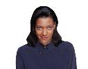

*Flavia Sparacino, Nuria Oliver, Alex Pentland and Glorianna Davenport — MIT Media Lab*

Presented at ISEA97, Chicago, September 1997.

## Overview

Responsive Portraits was an early interactive portrait project from the MIT Media Lab. Instead of showing one fixed photograph, the portrait changed as a visitor moved, looked, or made facial expressions.

The system used real-time computer vision to estimate the viewer's distance, head movement, point of view, and expression. Those signals selected different portrait poses and responses, making the image feel more like an encounter than a static display.

<figure>
  
  <figcaption>The portrait looks directly at the viewer.</figcaption>
</figure>

<figure>
  
  <figcaption>The portrait reacts with a playful, expressive gesture.</figcaption>
</figure>

## Publications

[[publication:sparacino1997responsive]]
