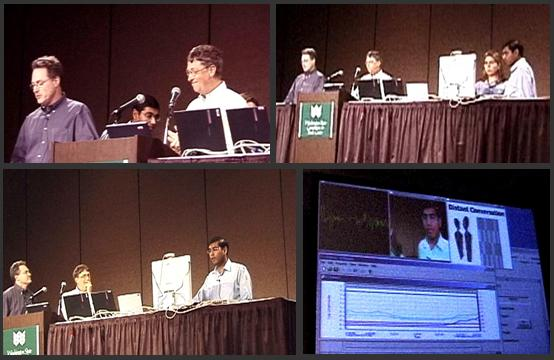

## Abstract

In this project we develop hierarchical probabilistic representations for modeling activities of people. We describe how to use our representation to do sensing, learning, and inference at multiple levels of temporal granularity and abstraction. The approach centers on Layered Hidden Markov Models (LHMMs) with parameters learned from data. LHMMs provide a robust means for modeling diverse human activities. We illustrate the application of LHMMs in an office-awareness setting, demonstrating the ability to correctly classify in real-time typical office activities such as talking on the phone, being in a meeting, giving a presentation, or performing general office work.

*SEER demonstration during Bill Gates' keynote at IJCAI 2001.*

## Publications

[A Comparison of HMMs and DBNs for Recognizing Office Activities](oliver-um05.pdf)
Nuria Oliver and Eric Horvitz.
*User Modeling 2005 (UM'05)*, Edinburgh, July 2005.

[Selective Perception Policies for Guiding Sensing and Computation in Multimodal Systems: A Comparative Analysis](oliver_cviuSpecIssue.pdf)
Nuria Oliver and Eric Horvitz.
*Computer Vision and Image Understanding (CVIU)*, Vol. 100, Issue 1–2, 2005.

[Selective Perception Policies for Limiting Computation in Multimodal Systems: A Comparative Analysis](icmi2003.pdf)
Nuria Oliver and Eric Horvitz.
*ICMI 2003*, Vancouver, November 2003.

[Layered Representations for Human Activity Recognition](olivern_layered.pdf)
Nuria Oliver, Eric Horvitz and Ashutosh Garg.
*ICMI 2002*, Pittsburgh, October 2002.

[Paper presented at CVPR 2001](11_oliver.pdf) (Cues in Communication Workshop)
Nuria Oliver, Eric Horvitz and Ashutosh Garg.

## Videos

- [Live demonstration during Bill Gates' IJCAI 2001 keynote](video/cvpr2001video_short.mpg)
