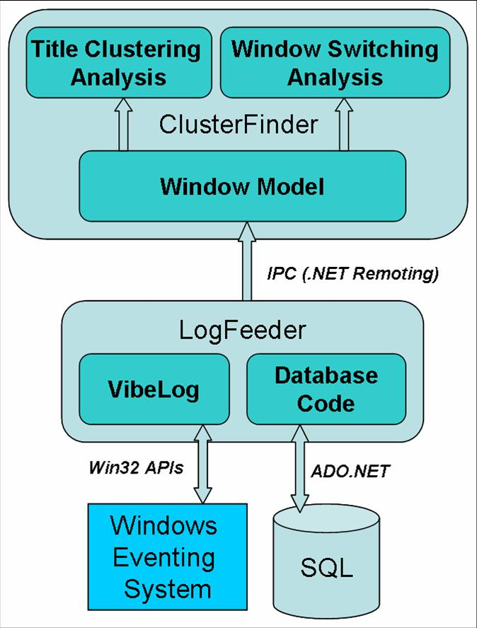

## Abstract

Information workers are often involved in multiple tasks that they must perform in parallel or in rapid succession, making task management itself a non-trivial overhead. Research on task management systems can help by enabling fast task switching, fast task resumption, and automatic task identification. In this paper we focus on automatically detecting the tasks that the user is involved in, by identifying which desktop windows are related to each other.

We built a prototype named SWISH that: (1) constantly monitors desktop activity via a stream of window events; (2) logs and processes this raw event stream; and (3) implements two criteria of window relatedness — the semantic similarity of window titles, and the temporal closeness of access patterns. We validated SWISH with 4 hours of user data, obtaining task classification accuracies of approximately 70%.

## Publications

[[publication:oliver2006swish]]
