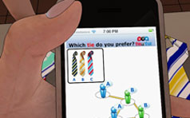
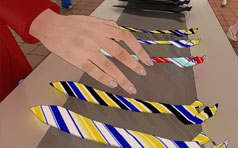

### Abstract

ThisOrThat is a mobile application that deals with social shopping. It
leverages on social networks to empower users in making more informed
every-day decisions and improve their shopping experience.

ThisOrThat users can describe topics that they are interested in and assign
to each of them group of friends whose opinion is valuable on that particular
topic.

  

During the shopping activities, ThisOrThat users can create instantly
surveys on their mobile phone to ask opinions to their friends on a
particular decision that they are about to make.

ThisOrThat is supported by a dynamic reputation and trust system that
evolves according to the comments and opinions that every participant
submits to the surveys.

Video

[Watch video](thisorthat.mov)

Papers

[“Shopping uncertainties in a mobile and
social context”](assets/papers/Pervasive2009.pdf) Cherubini, M., de Oliveira, R. and> Oliver, N. (2009)
Pervasive 2009, Late breaking results, Nara, Japan, 2009

Press

["Telefonica works on 3D video and social shopping".](assets/press/ExpansionCatalunyaOct08_1.pdf) Expansion Newspaper. Oct
2008

["Telefonica predicts that the
mobile phone will be used to do social shopping".](assets/press/ExpansionCatalunyaOct08.pdf)
Expansion Newspaper. Oct 2008

Core Team

:
[Nuria Oliver](/_index.md), Mauro Cherubini and Juan
Carlos Valverde

:
Federico Casalegno, David Boardman, Brian McMurray, Steve Pomeroy, Lauren
Silberman and Jason Terhorst

[Legal Disclaimer](http://thisorthat.ws/legal)

