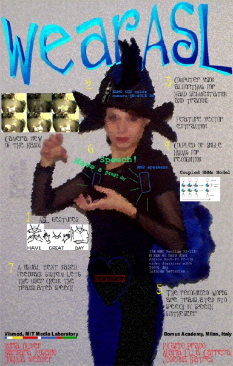

*Nuria Oliver, Barbara Rosario, Joshua Weaver and Alex Pentland — MIT Media Lab*
*Maria Ella Carrera, Ricardo Prado and Josefina Batres — Domus Academy Milan*

Presented at the MIT Media Lab Fashion Show, October 1997.

